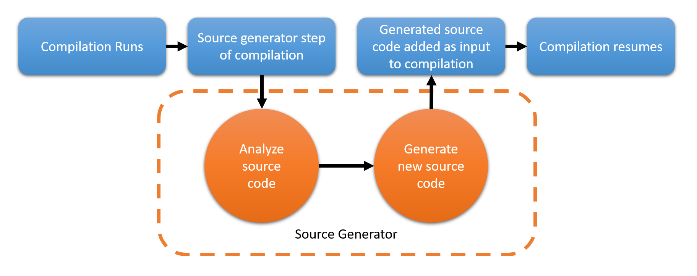

# Presentation

## What is a Source Generator?

- https://docs.microsoft.com/en-us/dotnet/csharp/whats-new/csharp-9#support-for-code-generator
- https://github.com/dotnet/roslyn/blob/master/docs/features/source-generators.cookbook.md
- https://devblogs.microsoft.com/dotnet/introducing-c-source-generators/
- https://blog.jetbrains.com/dotnet/2020/11/12/source-generators-in-net-5-with-resharper/


C# code generators are a component you can write that is similar to a roslyn analyzer or code fix. 
The difference is that code generators analyze code and write new source code files as part of the compilation process.
A typical code generator searches code for attributes or other conventions.

A source generator must be attributed with the _Generator_ attribute and implement the _ISourceGenerator_ interface. 
More detailed examples can be found in the source generators cookbook. 
In its most rudimentary form, we’d start with the following:
```c#
[Generator]
public class MyGenerator : ISourceGenerator
{
    public void Initialize(GeneratorInitializationContext context)
    {
    }

    public void Execute(GeneratorExecutionContext context)
    {
    }
}
```


A code generator reads attributes or other code elements using the Roslyn analysis APIs.
From that information, it adds new code to the compilation.



Source generators can only add code; they aren't allowed to modify any existing code in the compilation.

The two features added for code generators are extensions to partial method syntax, and module initializers.

## Partial methods

### Overview

- https://docs.microsoft.com/en-us/dotnet/csharp/programming-guide/classes-and-structs/partial-classes-and-methods
- https://docs.microsoft.com/en-us/dotnet/csharp/language-reference/proposals/csharp-9.0/extending-partial-methods
- https://www.infoq.com/news/2020/06/CSharp-9-Partial-Methods/


First, the changes to partial methods. Before C# 9.0, partial methods are private but can't specify an access modifier,
have a void return, and can't have out parameters. These restrictions meant that if no method implementation is provided,
the compiler removes all calls to the partial method. C# 9.0 removes these restrictions,
but requires that partial method declarations have an implementation.
Code generators can provide that implementation. To avoid introducing a breaking change,
the compiler considers any partial method without an access modifier to follow the old rules.
If the partial method includes the private access modifier, the new rules govern that partial method.

### Examples

```c#
// тут пример генератора для partial method
[Generator]
public class MyGenerator : ISourceGenerator
{
    public void Initialize(GeneratorInitializationContext context)
    {
    }

    public void Execute(GeneratorExecutionContext context)
    {
    }
}
```

## Module initializers

### Overview

- https://docs.microsoft.com/en-us/dotnet/csharp/language-reference/proposals/csharp-9.0/module-initializers
- https://docs.microsoft.com/en-us/dotnet/api/system.runtime.compilerservices.moduleinitializerattribute?view=net-5.0

The second new feature for code generators is module initializers.

Although the .NET platform has a feature that directly supports writing initialization code for the assembly (technically, the module), 
it is not exposed in C#. This is a rather niche scenario, but once you run into it the solutions appear to be pretty painful. 
There are reports of a number of customers (inside and outside Microsoft) struggling with the problem, and there are no doubt more undocumented cases.

Motivation
- Enable libraries to do eager, one-time initialization when loaded, with minimal overhead and without the 
  user needing to explicitly call anything
- One particular pain point of current static constructor approaches is that the runtime must do additional 
  checks on usage of a type with a static constructor, in order to decide whether the static constructor needs 
  to be run or not. This adds measurable overhead.
- Enable source generators to run some global initialization logic without the user needing to explicitly call anything

Module initializers are methods that have the ModuleInitializerAttribute attribute attached to them.
These methods will be called by the runtime before any other field access or method invocation within the entire module.

A module initializer method:

- Must be static
- Must be parameterless
- Must return void
- Must not be a generic method
- Must not be contained in a generic class
- Must be accessible from the containing module

That last bullet point effectively means the method and its containing class must be internal or public. The method can't be a local function.

### Examples

- https://www.cazzulino.com/module-initializers.html
- https://github.com/wieslawsoltes/Svg.Skia#svg-to-c-compiler
- https://github.com/trampster/JsonSrcGen
- https://github.com/devlooped/ThisAssembly
- https://github.com/ufcpp/StringLiteralGenerator
- https://devblogs.microsoft.com/dotnet/new-c-source-generator-samples/
- https://khalidabuhakmeh.com/module-initializers-in-csharp-9

Sync code:
```c#
using System;
using System.Runtime.CompilerServices;
using System.Threading;
using System.Threading.Tasks;

namespace Preview
{
    class Program
    {
        static void Main(string[] args)
        {
            Console.WriteLine(Name);
        }

        public static string Name;

        [ModuleInitializer]
        public static void Init()
        {
            Name = "Khalid";
        }
    }
}
```

Async code:

```c#
using System;
using System.Runtime.CompilerServices;
using System.Threading;
using System.Threading.Tasks;

namespace Preview
{
    class Program
    {
        static void Main(string[] args)
        {
            Console.WriteLine(Name);
        }

        public static string Name;

        [ModuleInitializer]
        public static async void Init()
        {
            Name = await GetName();
        }

        public static Task<string> GetName()
            => Task.FromResult("Khalid From Task!");
    }
}
```

### Possible security and other problems

- "Perhaps the existing third-party tooling for “injecting” module initializers is sufficient for users who have been asking for this feature."
- "A note for folks doing async initialization, remember to create CancellationToken instances so that apps don’t hang at startup indefinitely. 
  A network is a volatile place, and developers should program accordingly."
