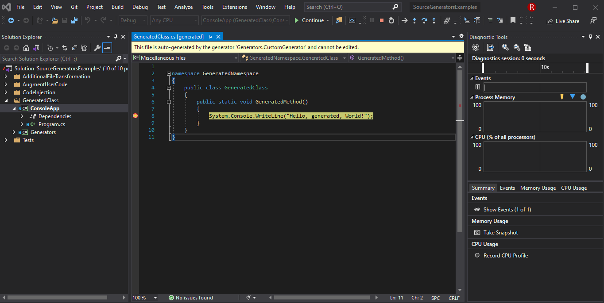
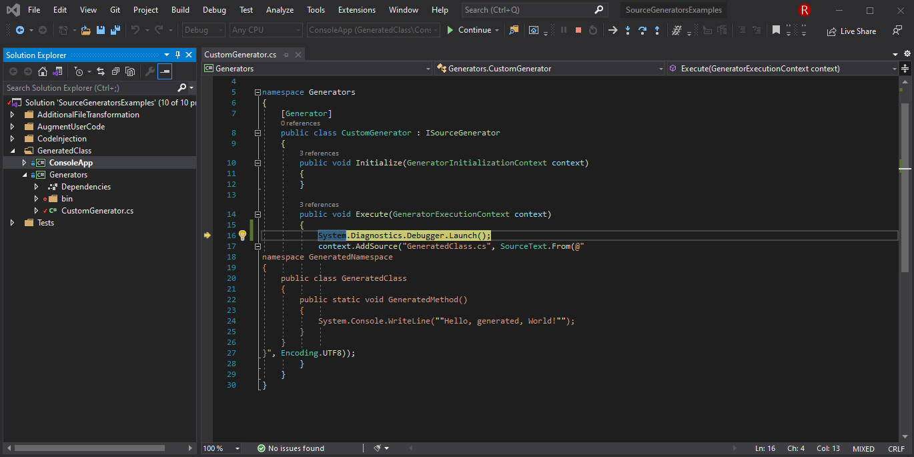

# Presentation

## What is a Source Generator?

- https://docs.microsoft.com/en-us/dotnet/csharp/whats-new/csharp-9#support-for-code-generator
- https://github.com/dotnet/roslyn/blob/master/docs/features/source-generators.cookbook.md
- https://devblogs.microsoft.com/dotnet/introducing-c-source-generators/
- https://blog.jetbrains.com/dotnet/2020/11/12/source-generators-in-net-5-with-resharper/

C# code generators are a component you can write that is similar to a roslyn analyzer or code fix. 
The difference is that code generators analyze code and write new source code files as part of the compilation process.
A typical code generator searches code for attributes or other conventions.

A source generator must be attributed with the _Generator_ attribute and implement the _ISourceGenerator_ interface. 
More detailed examples can be found in the source generators cookbook. 
In its most rudimentary form, we’d start with the following:
```c#
[Generator]
public class MyGenerator : ISourceGenerator
{
    public void Initialize(GeneratorInitializationContext context)
    {
    }

    public void Execute(GeneratorExecutionContext context)
    {
    }
}
```

```xml
<Project Sdk="Microsoft.NET.Sdk">

    <PropertyGroup>
        <TargetFramework>netstandard2.0</TargetFramework>
        <LangVersion>9</LangVersion>
    </PropertyGroup>

    <ItemGroup>
        <PackageReference Include="Microsoft.CodeAnalysis.CSharp" Version="3.8.0" PrivateAssets="all" />
        <PackageReference Include="Microsoft.CodeAnalysis.Analyzers" Version="3.3.2" PrivateAssets="all" />
    </ItemGroup>

</Project>
```


A code generator reads attributes or other code elements using the Roslyn analysis APIs.
From that information, it adds new code to the compilation.


Source generators can only add code; they aren't allowed to modify any existing code in the compilation.

## Examples

- https://github.com/wieslawsoltes/Svg.Skia#svg-to-c-compiler
- https://github.com/trampster/JsonSrcGen
- https://github.com/devlooped/ThisAssembly
- https://github.com/ufcpp/StringLiteralGenerator
- https://devblogs.microsoft.com/dotnet/new-c-source-generator-samples/


This section is broken down by user scenarios, with general solutions listed first, and more specific examples later on.

Add generator to project:

```xml
<ItemGroup>
  <ProjectReference Include="..\Generators\Generators.csproj">
      <OutputItemType>Analyzer</OutputItemType>
      <ReferenceOutputAssembly>False</ReferenceOutputAssembly>
  </ProjectReference>
</ItemGroup>
```

### Hello world

**User scenario:** As a generator author I want to be able to add a type to the compilation, that can be referenced by the user's code.

**Solution:** Have the user write the code as if the type was already present. Generate the missing type based on information available in the compilation.

**Example:**

Given the following user code:

```c#
static void Main(string[] args)
{
    // call into a generated method
    GeneratedNamespace.GeneratedClass.GeneratedMethod();
}
```

Create a generator that will create the missing type when run:

```c#
using System.Text;
using Microsoft.CodeAnalysis;
using Microsoft.CodeAnalysis.Text;

namespace Generators
{
	[Generator]
	public class CustomGenerator : ISourceGenerator
	{
		public void Initialize(GeneratorInitializationContext context)
		{
		}

		public void Execute(GeneratorExecutionContext context)
		{
			context.AddSource("GeneratedClass.cs", SourceText.From(@"
namespace GeneratedNamespace
{
    public class GeneratedClass
    {
        public static void GeneratedMethod()
        {
            System.Console.WriteLine(""Hello, generated, World!"");
        }
    }
}", Encoding.UTF8));
		}
	}
}
```

### Advanced

- https://docs.microsoft.com/en-us/dotnet/csharp/programming-guide/classes-and-structs/partial-classes-and-methods
- https://docs.microsoft.com/en-us/dotnet/csharp/language-reference/proposals/csharp-9.0/extending-partial-methods
- https://www.infoq.com/news/2020/06/CSharp-9-Partial-Methods/

**User scenario:**
As a generator author I want to be able to inspect and augment a user's code with new functionality.
As a generator author I want to be able to transform an external non-C# file into an equivalent C# representation.
As a generator author I want to be able to add diagnostics to the users compilation.

**Solution:** 
Require the user to make the class you want to augment be a `partial class`, and mark it with e.g. a unique attribute, or name.
Register a `SyntaxReceiver` that looks for any classes marked for generation and records them. Retrieve the populated `SyntaxReceiver`
during the generation phase and use the recorded information to generate a matching `partial class` that
contains the additional functionality.

Use the additional files property of the `GeneratorExecutionContext` to retrieve the contents of the file, convert it to the C# representation and return it.

Diagnostics can be added to the compilation via `GeneratorExecutionContext.ReportDiagnostic()`. These can be in response to the content of the users compilation:
for instance if the generator is expecting a well formed `AdditionalFile` but can not parse it, the generator could emit a warning notifying the user that generation can not proceed.

For code-based issues, the generator author should also consider implementing a [diagnostic analyzer](https://docs.microsoft.com/en-us/visualstudio/code-quality/roslyn-analyzers-overview?view=vs-2019) that identifies the problem, and offers a code-fix to resolve it.

There are some changes to partial methods. Before C# 9.0, partial methods are private but can't specify an access modifier,
have a void return, and can't have out parameters. These restrictions meant that if no method implementation is provided,
the compiler removes all calls to the partial method. C# 9.0 removes these restrictions,
but requires that partial method declarations have an implementation.
Code generators can provide that implementation. To avoid introducing a breaking change,
the compiler considers any partial method without an access modifier to follow the old rules.
If the partial method includes the private access modifier, the new rules govern that partial method.

Add file:
```xml
<?xml version="1.0" encoding="UTF-8" ?>
<country-list>
    <country>
        <name>Россия</name>
        <fullname>Российская Федерация</fullname>
        <english>Russian Federation</english>
        <alpha2>RU</alpha2>
        <alpha3>RUS</alpha3>
        <iso>643</iso>
        <location>Европа</location>
        <location-precise>Восточная Европа</location-precise>
    </country>
</country-list>
```

Add to project:
```xml
<ItemGroup>
    <AdditionalFiles Include="Files\Countries.xml"/>
</ItemGroup>
```

**Example:**

```c#
public partial class DirectoryOfCountries
{
    public static partial IReadOnlyList<Country> Europe();
}
```

```c#
[Generator]
public partial class AugmentingGenerator : ISourceGenerator
{
    private class CustomSyntaxReceiver : ISyntaxReceiver
    {
        public ClassDeclarationSyntax ClassToAugment { get; private set; }

        public void OnVisitSyntaxNode(SyntaxNode syntaxNode)
        {
            // Business logic to decide what we're interested in goes here
            if (syntaxNode is ClassDeclarationSyntax cds && cds.Identifier.ValueText == "DirectoryOfCountries")
            {
                ClassToAugment = cds;
            }
        }
    }
}

public partial class AugmentingGenerator
{
    public void Initialize(GeneratorInitializationContext context)
    {
        // Register a factory that can create our custom syntax receiver
        context.RegisterForSyntaxNotifications(() => new CustomSyntaxReceiver());
    }
}

public partial class AugmentingGenerator
{
    public void Execute(GeneratorExecutionContext context)
    {
        // the generator infrastructure will create a receiver and populate it
        // we can retrieve the populated instance via the context
        var directoryOfCountriesClass = ((CustomSyntaxReceiver) context.SyntaxReceiver).ClassToAugment;
        if (directoryOfCountriesClass is null)
        {
            return;
        }

        // get data from project
        var xmlData = context.AdditionalFiles
            .SingleOrDefault(a => Path.GetFileName(a.Path) == "Countries.xml")
            ?.GetText(context.CancellationToken)
            ?.ToString();
        if (xmlData is null)
        {
            ReportDiagnostic(context);
            return;
        }

        var generatedSource = GenerateSource(xmlData);
        context.AddSource("DirectoryOfCountries.Generated.cs", SourceText.From(generatedSource, Encoding.UTF8));

        var countrySource = "namespace Countries{ public record Country (string Name, string Code); }";
        context.AddSource("Country.cs", SourceText.From(countrySource, Encoding.UTF8));
    }

    private static void ReportDiagnostic(GeneratorExecutionContext context)
    {
        var error = new DiagnosticDescriptor(
            id: "AGEN001",
            title: "Could find XML file",
            messageFormat: "Could find XML file '{0}'",
            category: "FileTransformGenerator",
            defaultSeverity: DiagnosticSeverity.Error,
            isEnabledByDefault: true);

        context.ReportDiagnostic(Diagnostic.Create(error, Location.None, "Countries.xml"));
    }

    private static string GenerateSource(string countriesXml)
    {
        var countries = XElement.Parse(countriesXml)
            .Descendants("country")
            .Select(x => new
            {
                Name = x.Element("name")?.Value,
                Code = x.Element("alpha2")?.Value,
                Location = x.Element("location")?.Value,
            });

        var sb = new StringBuilder();
        sb.AppendLine("using System.Collections.Generic; namespace Countries {");
        sb.AppendLine("public partial class DirectoryOfCountries {");
        sb.AppendLine("private static List<Country> _europe = new List<Country> {");
        foreach (var country in countries.Where(c => c.Location == "Европа"))
        {
            sb.Append($"new Country (\"{country.Name}\", \"{country.Code}\"),");
        }

        sb.AppendLine("};");
        sb.AppendLine("public static partial IReadOnlyList<Country> Europe() => _europe; }}");

        return sb.ToString();
    }
}

```


## Debugging

- https://nicksnettravels.builttoroam.com/debug-code-gen/
- https://dominikjeske.github.io/source-generators/
- https://www.cazzulino.com/source-generators.html

To see output files add to project:

```xml
<PropertyGroup>
    <EmitCompilerGeneratedFiles>true</EmitCompilerGeneratedFiles>
    <CompilerGeneratedFilesOutputPath>$(BaseIntermediateOutputPath)\GeneratedFiles</CompilerGeneratedFilesOutputPath>
</PropertyGroup>
```

Add breakpoint to generated code:



Add to generator's code:



```c#
Debugger.Launch();
```

## Unit Testing of Generators

**User scenario**: As a generator author, I want to be able to unit test my generators to make development easier and ensure correctness.

**Solution**: A user can host the `GeneratorDriver` directly within a unit test, making the generator portion of the code relatively simple to unit test. A user will need to provide a compilation for the generator to operate on, and can then probe either the resulting compilation, or the `GeneratorDriverRunResult` of the driver to see the individual items added by the generator.

Starting with a basic generator that adds a single source file:

```c#
[Generator]
public class CustomGenerator : ISourceGenerator
{
    public void Initialize(GeneratorInitializationContext context) {}

    public void Execute(GeneratorExecutionContext context)
    {
        context.AddSource("myGeneratedFile.cs", SourceText.From(@"
namespace GeneratedNamespace
{
    public class GeneratedClass
    {
        public static void GeneratedMethod()
        {
            // generated code
        }
    }
}", Encoding.UTF8));
    }
}
```

As a user, we can host it in a unit test like so:

```c#
using System.Linq;
using System.Reflection;
using Microsoft.CodeAnalysis;
using Microsoft.CodeAnalysis.CSharp;
using Xunit;

namespace Generators.Test
{
	public class UnitTest1
	{
		[Fact]
		public void Test1()
		{
			// Create the 'input' compilation that the generator will act on
			var inputCompilation = CreateCompilation(@"
namespace MyCode
{
    public class Program
    {
        public static void Main(string[] args)
        {
        }
    }
}
");

			// directly create an instance of the generator
			// (Note: in the compiler this is loaded from an assembly, and created via reflection at runtime)
			var generator = new CustomGenerator();

			// Create the driver that will control the generation, passing in our generator
			GeneratorDriver driver = CSharpGeneratorDriver.Create(generator);

			// Run the generation pass
			// (Note: the generator driver itself is immutable, and all calls return an updated version of the driver that you should use for subsequent calls)
			driver = driver.RunGeneratorsAndUpdateCompilation(inputCompilation, out var outputCompilation, out var diagnostics);

			// We can now assert things about the resulting compilation:
			Assert.True(diagnostics.IsEmpty); // there were no diagnostics created by the generators
			Assert.True(outputCompilation.SyntaxTrees.Count() == 2); // we have two syntax trees, the original 'user' provided one, and the one added by the generator
			Assert.True(outputCompilation.GetDiagnostics().IsEmpty); // verify the compilation with the added source has no diagnostics

			// Or we can look at the results directly:
			var runResult = driver.GetRunResult();

			// The runResult contains the combined results of all generators passed to the driver
			Assert.True(runResult.GeneratedTrees.Length == 1);
			Assert.True(runResult.Diagnostics.IsEmpty);

			// Or you can access the individual results on a by-generator basis
			var generatorResult = runResult.Results[0];
			Assert.True(generatorResult.Generator == generator);
			Assert.True(generatorResult.Diagnostics.IsEmpty);
			Assert.True(generatorResult.GeneratedSources.Length == 1);
			Assert.True(generatorResult.Exception is null);
		}

		private static Compilation CreateCompilation(string source)
			=> CSharpCompilation.Create("compilation",
				new[] {CSharpSyntaxTree.ParseText(source)},
				new[] {MetadataReference.CreateFromFile(typeof(Binder).GetTypeInfo().Assembly.Location)},
				new CSharpCompilationOptions(OutputKind.ConsoleApplication));
	}
}
```

## Package a generator as a NuGet package

- https://roslyn-analyzers.readthedocs.io/en/latest/create-nuget-package.html

**User scenario**: As a generator author I want to package my generator as a NuGet package for consumption.

**Solution:** Generators can be packaged using the same method as an Analyzer would.
Ensure the generator is placed in the `analyzers\dotnet\cs` folder of the package for it to be automatically added to the users project on install.

For example, to turn your generator project into a NuGet package at build, add the following to your project file:

```xml
<PropertyGroup>
    <GeneratePackageOnBuild>true</GeneratePackageOnBuild> <!-- Generates a package at build -->
    <IncludeBuildOutput>false</IncludeBuildOutput> <!-- Do not include the generator as a lib dependency -->
</PropertyGroup>

<ItemGroup>
    <!-- Package the generator in the analyzer directory of the nuget package -->
    <None Include="$(OutputPath)\$(AssemblyName).dll" Pack="true" PackagePath="analyzers/dotnet/cs" Visible="false" />
</ItemGroup>
```

## Problems

- https://docs.microsoft.com/en-us/dotnet/api/system.runtime.compilerservices.moduleinitializerattribute?view=net-5.0
- https://khalidabuhakmeh.com/module-initializers-in-csharp-9

"Perhaps the existing third-party tooling for “injecting” module initializers is sufficient for users who have been asking for this feature."

- Not easy to work with Roslyn code model (AST)
- Performance affects compilation time
- Silent work and IDE support needed
- Security of third-party nuget packages

## References

all the references from presentation
